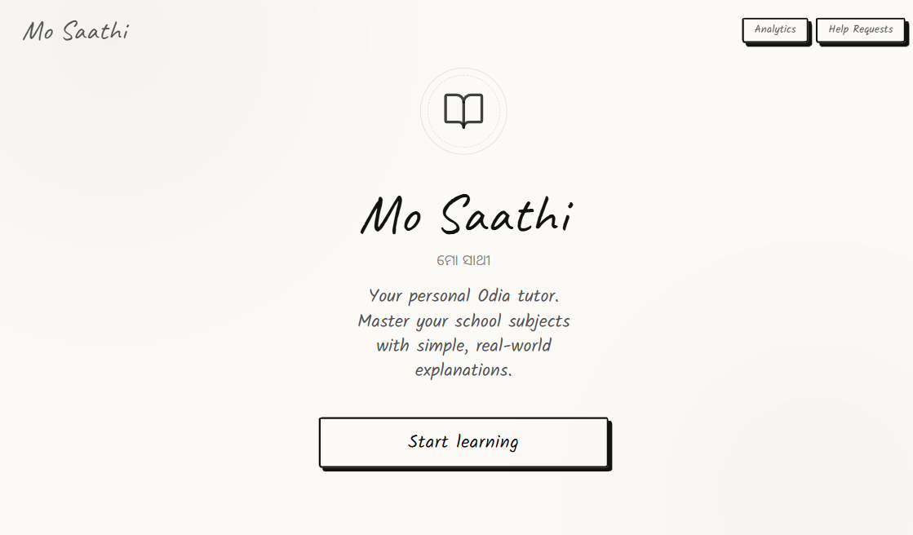
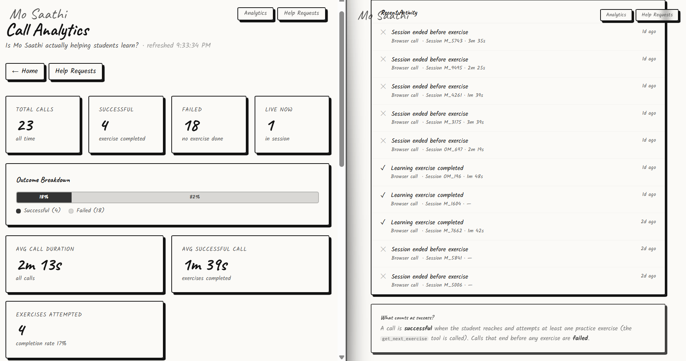
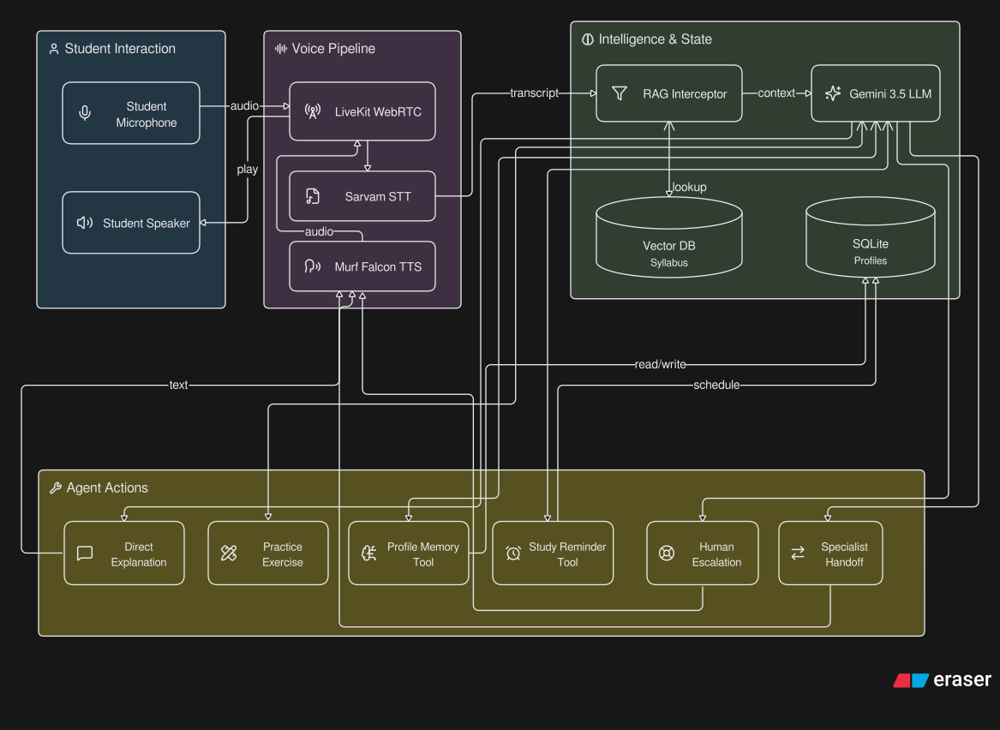

<div align="center">
  
  <br/>
  <h1>Mo Saathi (ମୋ ସାଥୀ)</h1>
  <p><i>Your personal Odia tutor. Hand-drawn UI, human-like voice, and a heart for students.</i></p>
  
  [](https://livekit.io)
  [](https://murf.ai)
  [](https://sarvam.ai)
  [](https://ai.google.dev/)
</div>

<br/>

> "ଆଜି ଆମେ Physics ବିଷୟରେ ପଢ଼ିବା?"
> (Shall we study Physics today?)

Most AI tools speak English. A few speak Hindi. Mo Saathi speaks Odia. Built for the 50 million speakers in Odisha, Mo Saathi is not a generic wrapper around an LLM. It is a fully stateful, context-aware voice agent that remembers you, tests your knowledge, calls your phone to remind you to study, and knows exactly when to ask a human teacher for help. 

The interface embraces a "pencil box" aesthetic. It is minimal, distraction-free, and deeply nostalgic, stripping away complex UI in favor of a clean, hand-drawn notebook layout.

<div align="center">
  
  <br/>
  <i>The Analytics & Teacher Escalation Dashboard</i>
</div>

---

## The System and Its Capabilities

Mo Saathi was engineered iteratively to build a robust educational pipeline. The focus was never on maximizing features, but on building trust, statefulness, and actual utility.

### Native Language Processing
The agent relies on Sarvam AI for flawless Odia speech-to-text (STT) transcription. Sarvam's models are natively tuned for Indic languages, allowing Mo Saathi to understand code-mixed Odia and English without the high latency of generic translators. This transcribed text is fed into Google Gemini 3.5 Flash Lite, which acts as the reasoning engine, and the response is synthesized back into natural, conversational Odia using Murf AI (Falcon).

### Stateful Memory and Context Grounding
A learning companion is useless if it forgets you. The system uses a local SQLite database to persist student profiles across sessions. When a student joins, the agent dynamically pulls their last studied topics and recurring mistakes. Furthermore, responses are grounded using a local Retrieval-Augmented Generation (RAG) pipeline (powered by `sentence-transformers`), pulling factual context directly from Class 9 and 10 Science and Maths syllabi.

### Interactive Tool Use and Outbound Telephony
Mo Saathi operates autonomously. It can fetch dynamic practice exercises and evaluate the student's answers on the fly. Beyond the browser, it supports live outbound SIP calling via Linphone. If a student asks to be reminded to study at a specific time, a background cron job schedules the LiveKit SIP trunk to dial their phone, initiating a scripted, consent-first reminder call.

### Human Escalation and Real-Time Analytics
AI is not perfect, and students occasionally experience emotional distress or severe academic frustration. When the agent detects these triggers, it halts the lesson, asks for the student's consent, and generates a structured escalation ticket. This triggers a colored-priority email to a human teacher via Resend. Every interaction is monitored on a custom, server-rendered Next.js dashboard showing Total Calls, Success Rates (measured deterministically by exercises attempted), and Live Active sessions.

### Specialist Agent Handoff
A single system prompt cannot master every nuance. When a student asks for an intricate breakdown of Physics, Chemistry, or Biology, Mo Saathi seamlessly transfers the active LiveKit room to a secondary agent: Vigyan Saathi (ବିଜ୍ଞାନ ସାଥୀ). This specialist inherits the full chat context, switches to a distinct voice (Murf Aarav), and dives deep into the sciences without missing a beat.

---

## Architecture and Flow

<div align="center">
  
  <br/>
  <i>The real-time voice pipeline and intelligence layer</i>
</div>


```mermaid
graph TD
    Client["Next.js Frontend"]
    Dash["Analytics Dashboard"]

    LK["LiveKit Server"]
    Agent["Python Backend"]

    DB[("SQLite Storage")]
    RAG[("Vector Knowledge Base")]

    Murf["Murf TTS"]
    Gemini["Gemini Reasoning"]
    Sarvam["Sarvam STT"]
    Resend["Resend Mailer"]

    Client <-->|WebRTC| LK
    Dash <-->|Metrics| DB
    LK <-->|Audio Stream| Agent
    Agent <-->|Memory Context| DB
    Agent <-->|Knowledge Retrieval| RAG

    Agent --> Sarvam
    Agent --> Gemini
    Agent --> Murf
    Agent --> Resend
````

### The Handoff Sequence

```mermaid
sequenceDiagram
    participant Student
    participant Main as Mo Saathi
    participant Specialist as Vigyan Saathi

    Student->>Main: Newton's Second Law question
    Main->>Student: Connecting you to the Science specialist
    Main->>Specialist: Transfer conversation context
    Specialist->>Student: Continues the Science explanation
```

---

## Local Setup

The repository is structured into two main services. You will need `uv` for Python dependency management and `pnpm` for the frontend.

### 1. Backend Service

```bash
cd backend

cp .env.example .env.local
```
Add your required API keys to `.env.local`: `LIVEKIT_URL`, `LIVEKIT_API_KEY`, `LIVEKIT_API_SECRET`, `GOOGLE_API_KEY`, `MURF_API_KEY`, `DEEPGRAM_API_KEY`, and `RESEND_API_KEY`. (Note: Deepgram is available as a fallback, but Sarvam is preferred).

```bash
uv sync
uv run python src/agent.py dev
```

### 2. Frontend Application

```bash
cd frontend

cp .env.example .env.local
```
Populate `.env.local` with your LiveKit credentials.

```bash
pnpm install
pnpm dev
```
Navigate to `http://localhost:3000` to interact with the agent, or `http://localhost:3000/analytics` to monitor the real-time dashboard.

---

## Contribution

We welcome contributions to expand the knowledge base, refine the UI, or migrate the local SQLite instance to PostgreSQL for production scaling. 

<div align="center">
  <br/>
  <i>Built for the students of Odisha.</i>
</div>
